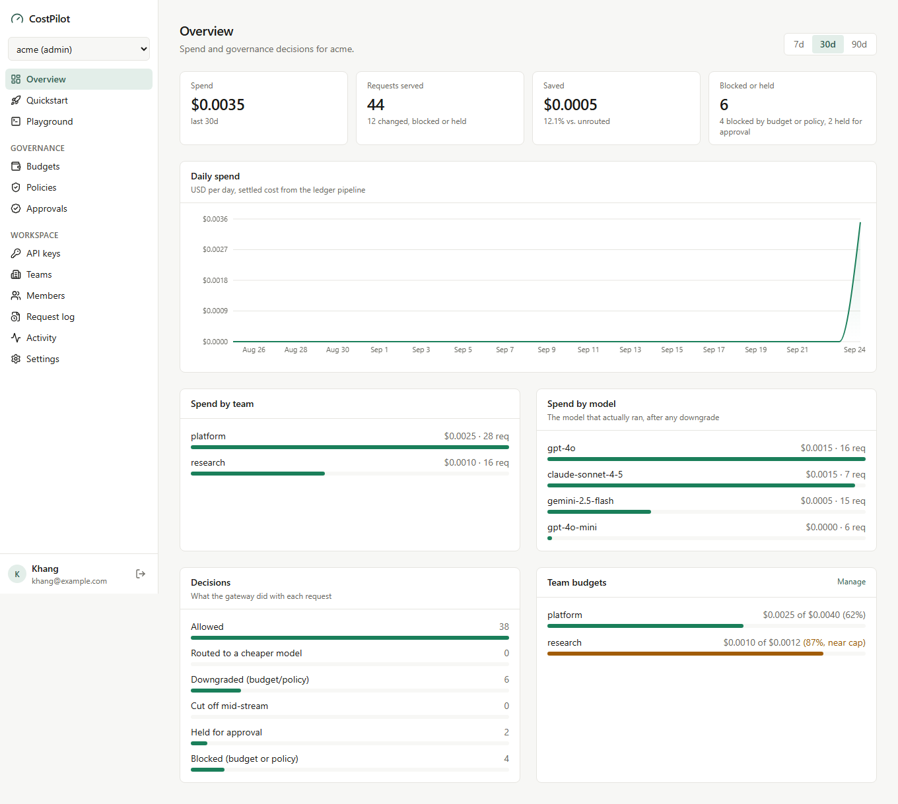

<div align="center">


# CostPilot

*Nobody knew who was spending the money.*<br>
*The bill only showed up at the end of the month, and by then it was gone.*

**An AI spending gateway that says no before the money is gone.**

<p>
&nbsp;&nbsp;&nbsp;&nbsp;&nbsp;
&nbsp;&nbsp;&nbsp;&nbsp;&nbsp;
&nbsp;&nbsp;&nbsp;&nbsp;&nbsp;
&nbsp;&nbsp;&nbsp;&nbsp;&nbsp;
&nbsp;&nbsp;&nbsp;&nbsp;&nbsp;

</p>

<a href="docs/README.md"><b>Setup and usage docs</b></a> · <a href="docs/README.md#2-the-console"><b>Console</b></a> · <a href="sdk/typescript/"><b>TypeScript SDK</b></a> · <a href="docs/BENCHMARK.md"><b>Benchmarks</b></a>

</div>

---

## Architecture

Ten steps. Everything the request touches lights up as it goes.

<p align="center">
  
</p>

| # | step | decides |
|:---:|---|---|
| 1 | **Auth** | who you are, from a hashed key, never from a header you sent |
| 2 | **Normalize** | your OpenAI shaped request becomes one internal shape |
| 3 | **Policy** | allow, deny, quietly downgrade, or hold for a human |
| 4 | **Cache** | close enough to something already answered, serve it for free |
| 5 | **Route** | cheapest model that still clears the bar you asked for |
| 6 | **Budget** | reserve the worst case cost across every scope that governs you |
| 7 | **Forward** | out to OpenAI, Anthropic, Gemini, or the built in mock |
| 8 | **Meter** | count the money as it streams, cut off cleanly on breach |
| 9 | **Ledger** | write the real charge, once, even if you hang up |
| 10 | **Settle** | release, publish, and leave an audit row explaining the verdict |

## The console

Budgets and policies are only useful if the people paying the bill can see and change them. The console is a multi-user web app on top of the gateway: sign in with GitHub or Google, get a workspace, invite your team, mint keys, set caps, approve held requests, and watch spend per team and model.

<p align="center">
  
</p>

Each workspace is a hard tenant boundary. Two workspaces can both have a team called `platform` and never share a budget counter, a policy, an approval or an analytics row, and that is covered by an integration test rather than a promise. API keys keep working exactly as before; the dashboard uses a separate session chain with CSRF protection.

## Quickstart

Docker is the only thing you need, and the demo costs nothing because the default upstream is a mock provider that lives inside the app.

```bash
git clone https://github.com/khangpt2k6/CostPilot.git
cd CostPilot
docker compose up --build -d
```

Open <http://localhost:3000> and sign in with any email (local dev login, no password). You land in your own workspace and are also an admin of the seeded `acme` demo workspace, which already has keys and traffic.

Then send a governed request from code:

```ts
import { CostPilot, BudgetExceededError } from "@costpilot/sdk";

const cp = new CostPilot({ apiKey: "cp_demo_team_platform", baseURL: "http://localhost:8080" });
const res = await cp.chat.completions.create({ model: "gpt-4o", messages: [{ role: "user", content: "hi" }] });
res.governance; // { modelDowngraded, modelRouted, budgetWarning, cacheHit }
```

The ten minute demo, the console, the CLI, both SDKs, and going live with real providers:

### → [Setup and usage docs](docs/README.md)

## Repo layout

```
build.gradle  settings.gradle  gradlew  gradle/   build entry point (must be root)
docker-compose.yml  docker-compose.real.yml       demo stack (must be root)
docker/                                           Dockerfile + service configs
src/                                              gateway source (Java only)
web/                                              console (Next.js), its own Docker image
cli/                                              admin CLI, its own Gradle subproject
sdk/typescript/  sdk/python/                      clients, not Gradle modules
docs/  loadtest/                                  documentation and benchmarks
```

Four root files are load bearing and cannot be tidied into a subdirectory:

- **`settings.gradle`** is how Gradle finds the build at all. It is discovered from the invocation directory, so moving it breaks `./gradlew`, IDE import, CI, and the Docker build in one shot. `build.gradle`, `gradlew`, and `gradle/` are anchored to it.
- **`docker-compose*.yml`** are discovered from the current directory too. Compose does not search subdirectories, so moving them turns the one-line quickstart above into `docker compose -f docker/compose.yml ...` everywhere, including every benchmark script.

Everything that *can* move, has. The Dockerfile lives in [docker/Dockerfile](docker/Dockerfile) (compose passes it explicitly with the repo root still as the build context), and the coverage gate lives in [gradle/coverage.gradle](gradle/coverage.gradle) so `build.gradle` stays a plugin and dependency manifest.

`docs/` stays at the root rather than moving under `src/` on purpose: `src/` is the Gradle source root, so every path under it is compiler or resource input. Markdown placed there would either be packaged into the jar or ignored, and GitHub stops rendering `docs/` specially. Documentation is not source.

---

<div align="center">

<br>
<sub>Built because a dashboard has never stopped a single dollar from leaving.</sub>
</div>
